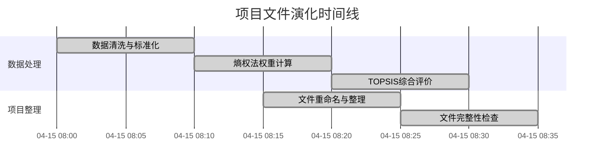
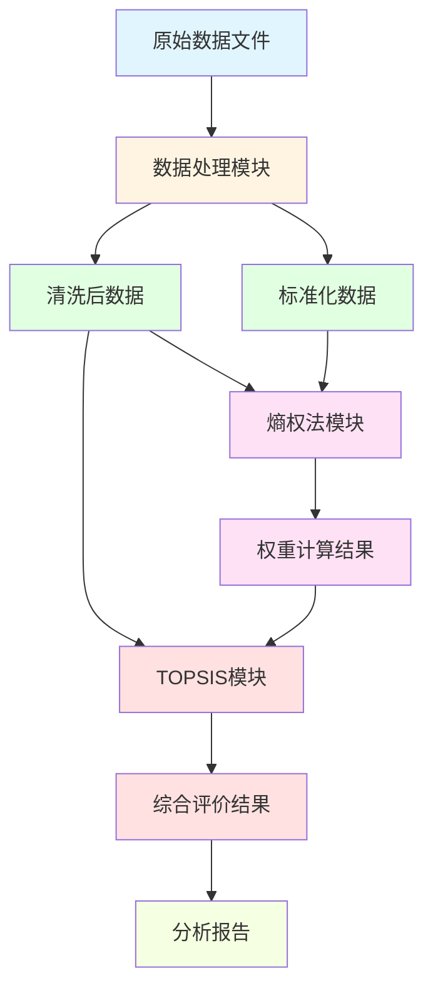
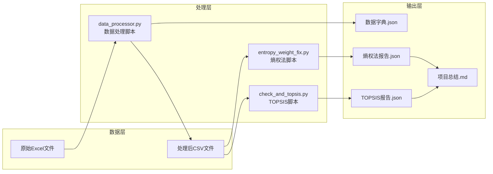
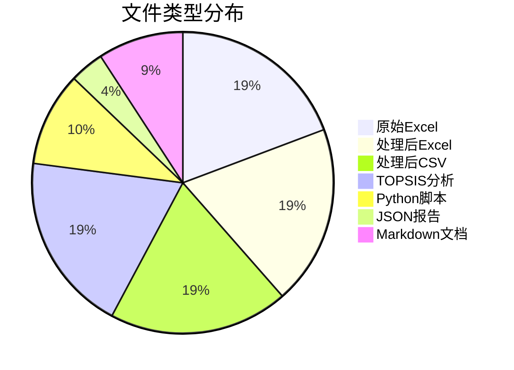
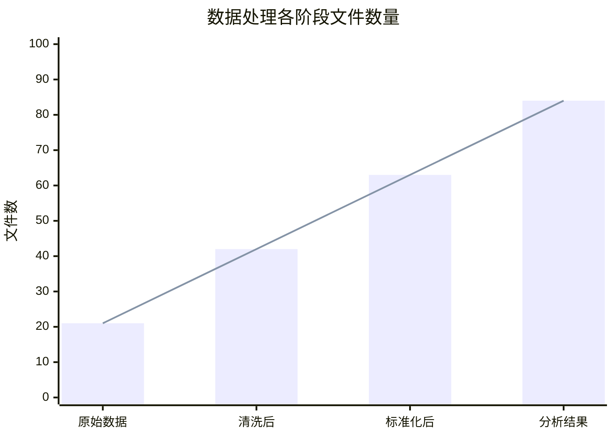
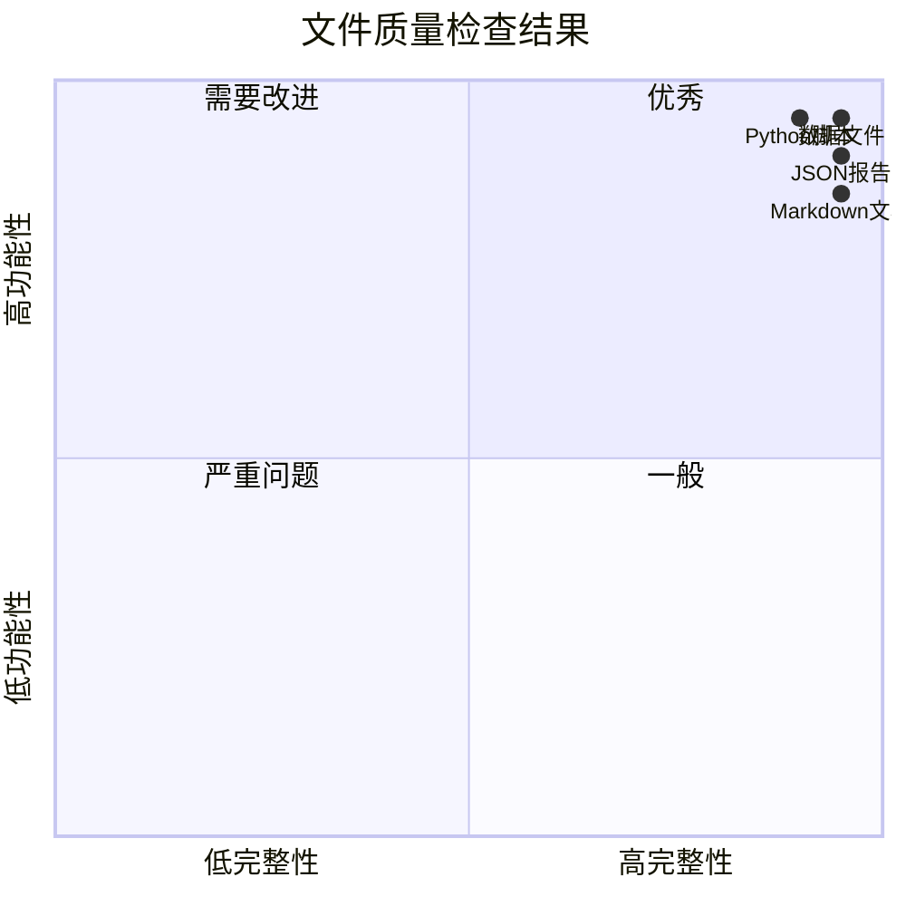

# 文件演化可视化模板

## 模板说明

本文档提供文件演化过程的可视化模板，用于展示文件的修改历史、版本变化和时间线关系。

---

## 一、时间线可视化模板

### 1.1 项目整体时间线



### 1.2 单文件版本演化时间线

```mermaid
timeline
    title 文件演化时间线示例
    section 数据处理阶段
        2026-04-15 08:00
            : 原始Excel文件
            : 数据加载与格式转换
        2026-04-15 08:05
            : 缺失值处理
            : 重复值移除
        2026-04-15 08:10
            : 异常值检测与处理
            : 数据标准化
        2026-04-15 08:15
            : 生成处理后文件
            : 生成数据字典
    
    section 综合评价阶段
        2026-04-15 08:20
            : 熵权法权重计算
            : TOPSIS综合评价
        2026-04-15 08:30
            : 生成分析报告
```

---

## 二、文件依赖关系可视化模板

### 2.1 模块依赖关系图



### 2.2 文件调用关系图



---

## 三、文件变更对比可视化模板

### 3.1 文件数量变化图表



### 3.2 处理阶段数据量变化



---

## 四、质量检查结果可视化模板

### 4.1 检查结果汇总



### 4.2 问题严重程度分布

```mermaid
bar
    title 问题严重程度分布
    x-axis Critical High Medium Low
    y-axis 问题数量
    bar [0, 0, 0, 0]
```

---

## 五、使用说明

### 5.1 如何使用这些模板

1. **复制模板**: 将需要的模板复制到您的文档中
2. **替换数据**: 根据实际项目数据替换模板中的示例数据
3. **调整样式**: 根据需要调整图表的样式和颜色
4. **保存文档**: 保存为Markdown文件，支持预览

### 5.2 Mermaid图表说明

本模板使用Mermaid语法创建图表，支持：
- 甘特图（Gantt）- 时间线展示
- 流程图（Flowchart）- 依赖关系
- 饼图（Pie）- 占比分析
- 柱状图（Bar）- 数量对比
- 象限图（Quadrant）- 二维分析

### 5.3 可视化工具支持

- VS Code + Mermaid插件
- Markdown编辑器（Typora、Obsidian等）
- 在线Mermaid编辑器（mermaid.live）
